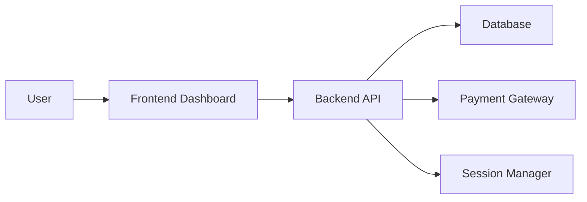

# 🚀 Psych Support


---

## 📌 Overview

**Psych Support** is a web platform designed to deliver structured psychological training programs.
It includes user dashboards, payment processing, and session management to support scalable mental wellness programs.

---

## 🧠 Key Features

* 👤 User authentication & dashboards
* 📅 Session scheduling & management
* 💳 Payment integration
* 📊 Progress tracking
* 🔐 Secure user data handling

---

## ⚙️ DevOps Architecture

This project is designed with modern DevOps practices in mind:

* CI/CD automation using GitHub Actions
* Containerized deployment using Docker
* Environment-based configuration
* Scalable modular backend structure

---

## 🐳 Docker Setup

```bash
# Build image
docker build -t psych-support .

# Run container
docker run -p 3000:3000 psych-support
```

---

## 🚀 Getting Started (Local Development)

```bash
# Clone repo
git clone https://github.com/kebulangrid-lab/psych-support.git

# Move into project
cd psych-support

# Install dependencies
npm install

# Start app
npm start
```

---

## 📊 System Design



---

## ☁️ Deployment

* Containerized using Docker
* CI/CD pipeline triggered on every push
* Designed for deployment on AWS / VPS / cloud platforms

---

## 🛠️ Tech Stack

* Frontend: React / HTML / CSS
* Backend: Node.js / Express
* Database: MongoDB / SQL (update if different)
* DevOps: Docker, GitHub Actions

---

## 🤝 Contributing

```bash
git checkout -b feature-name
git commit -m "Add feature"
git push origin feature-name
```

Then open a Pull Request.

---

## 📈 Future Improvements

* Kubernetes orchestration
* Monitoring (Prometheus/Grafana)
* Load balancing
* Role-based access control
* API rate limiting

---

## 📄 License

This project is licensed under the MIT License.

---
